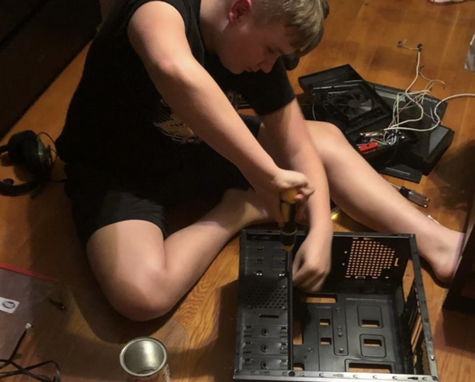

## Background

I'm a first-generation computer science student from Belle Vernon, PA. Currently a junior at the University of Pittsburgh's School of Computing and Information, I enjoy building systems and innovating with new technologies. I am a self-starter, fascinated by improving software solutions in real-time.

In my free time, I enjoy music production and exploring nature. I have been making music for several years and love experimenting with different genres and sounds. Recently I wonder if I have more hours reading code documentation or crate digging for soul samples in the unpredictable Youtube algorithm.

## Teaching & Community

I work as a teaching assistant and peer tutor for SCI, helping students during appointments and office hours. These interactions help sharpen my technical communication and understand how people learn new things.

I enjoy mentoring others and exchanging knowledge. I believe that technology is a powerful tool for empowerment and growth.

*Presenting at AI in Action Hackathon*

## Interests

I care about green computing, efficient algorithms, and accessibility. I aim to make software that's fast, lightweight, and easy for everyone to use. Originally a psychology major, I care about making software that improves the human experience and education.

Some of my favorite areas of software design include native app development, functional programming, and data visualization. I enjoy working on projects that combine these elements to create fast and intuitive interfaces.

I prioritize open source software and ownership of data in technology. This has led me to invest and build AI apps that are self-contained. I like to imagine a world where intelligence is equally available to everyone for free.

*Building my first PC in middle school*
